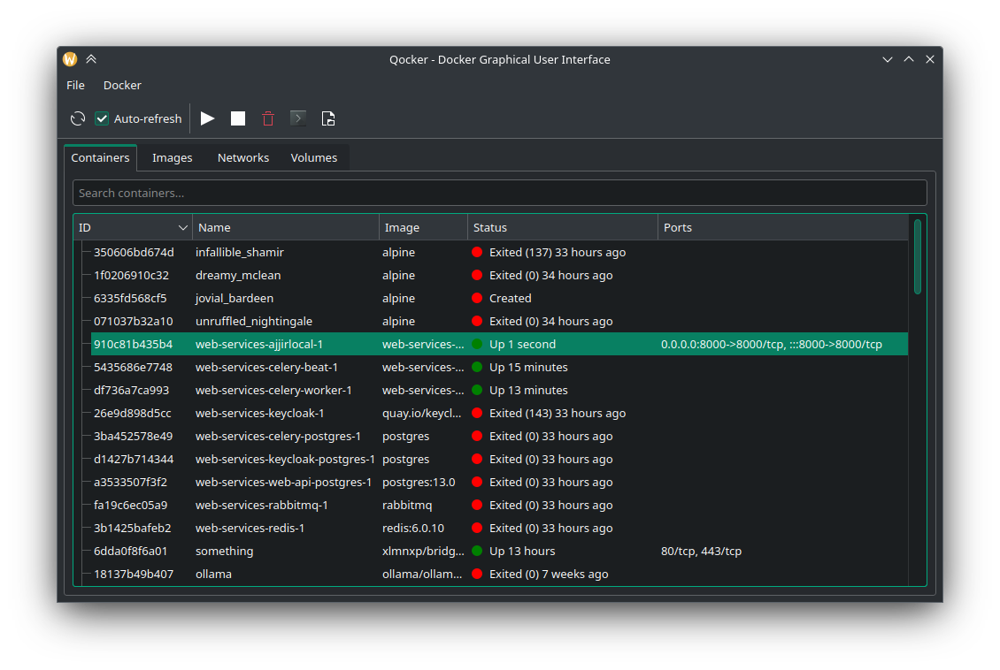

# Qocker



Qocker is a user-friendly GUI application for managing Docker containers. Built with PyQt5, it provides an intuitive interface for viewing and interacting with your Docker containers.

## Features

- **Container Overview**: View all your Docker containers in a tree-like structure.
- **Quick Terminal Access**: Open a terminal for any container with a double-click.
- **Container Management**: Start, stop, and remove containers directly from the GUI.
- **Real-time Updates**: Container statuses are updated in real-time.
- **Cross-platform**: Works on Windows, macOS, and Linux.

## Installation

1. Ensure you have Python 3.6+ and Docker installed on your system.
2. Clone this repository:
```
git clone https://github.com/xlmnxp/qocker.git
```

3. Navigate to the project directory:
```
cd qocker
```
4. Install the required dependencies:
```
pip install -r requirements.txt
```

## Usage

To start Qocker, run:
```
python3 main.py
```

- **View Containers**: All your Docker containers will be displayed in the main window.
- **Open Terminal**: Double-click on any container to open a terminal session for that container.
- **Manage Containers**: Use the buttons or context menu to start, stop, or remove containers.

## Requirements

- Python 3.6+
- PyQt5
- Docker

## Contributing

Contributions to Qocker are welcome! Please feel free to submit a Pull Request.

## License

This project is licensed under the GNU General Public License v3.0 - see the [LICENSE](LICENSE.md) file for details.

## Acknowledgments

- Thanks to the PyQt and Docker teams for their fantastic tools.

## Contact

If you have any questions, feel free to reach out to me at [email](mailto:s@sy.sa).